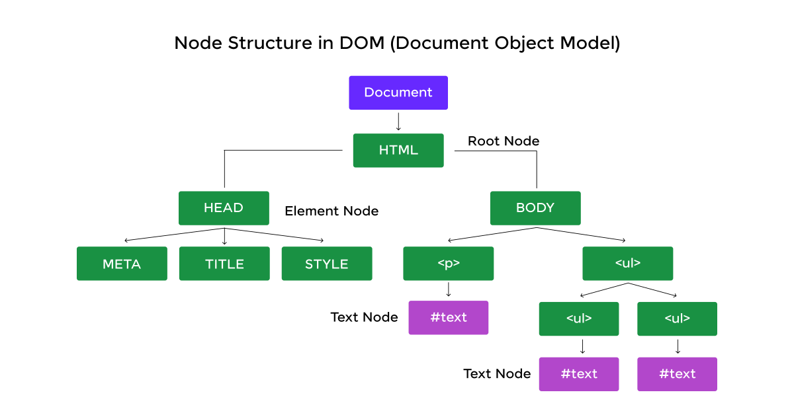

# El DOM (Document Object Model)
---

## Descripción

El DOM, o Document Object Model, es una [API](https://developer.mozilla.org/es/docs/Glossary/API) definida para representar e interactuar con cualquier documento [HTML](https://developer.mozilla.org/es/docs/Glossary/HTML) o [XML](https://developer.mozilla.org/es/docs/Glossary/XML) . Es una representación de la estructura de un documento HTML que proporciona una forma de interactuar y manipular los elementos de la página mediante programación. Esencialmente, el DOM convierte una página web en un árbol de nodos que puedes manipular con JavaScript para cambiar su contenido, estructura y estilo.



## Métodos y propiedades del DOM

Los **métodos** y **propiedades** son formas de interactuar con los nodos (elementos) del documento HTML, pero tienen diferencias clave:

### **Propiedades**

- Son **atributos o características** de los nodos del DOM.
- Representan valores asociados a un elemento que puedes leer o modificar directamente.
- Ejemplo: `innerText`, `id`, `style`.

 ```javascript
const heading = document.getElementById("title");
console.log(heading.innerText); // Leer el texto del elemento
heading.innerText = "Nuevo título"; // Modificar el texto
```

### **Métodos**

- Son **acciones o funciones** que puedes realizar en los nodos del DOM.
- Permiten ejecutar operaciones, como buscar, modificar o agregar elementos.
- Ejemplo: `getElementById()`, `appendChild()`, `remove()`.

```javascript
const container = document.getElementById("container");
const newElement = document.createElement("div");
container.appendChild(newElement); // Agregar un nuevo elemento
```

| **Propiedades**                      | **Métodos**                      |
| ------------------------------------ | -------------------------------- |
| Representan **valores**.             | Son **acciones** o funciones.    |
| Se acceden y modifican directamente. | Se llaman para realizar tareas.  |
| Ejemplo: `element.id`                | Ejemplo: `element.appendChild()` |

## Métodos del DOM
---

El DOM ofrece una amplia gama de métodos que permiten interactuar, manipular y acceder a los elementos y nodos de un documento HTML. Estos métodos facilitan la modificación de la estructura, el estilo y el contenido de la página web. A continuación, se muestran algunos de los métodos del DOM más comunes y útiles.

### Seleccionar elementos en el DOM

Si queremos trabajar con algún elemento del HTML debemos seleccionarlo y traerlo a nuestro archivo JS. Para ello podemos usar uno de los siguientes métodos:

- `document.getElementById(id)`
- `document.querySelector(selector)`
- `document.querySelectorAll(selector)`
- `document.getElementsByClassName(class)`

### `document.getElementById(id)`

Este método devuelve un elemento por su ID. Es útil para acceder a un elemento específico en la página.

Ejemplo:

```javascript
let elemento = document.getElementById("miElemento");
```

### `document.querySelector(selector)`

Devuelve el **primer** elemento que coincide con un selector CSS. Permite seleccionar elementos de manera más precisa.

Ejemplo:

```javascript
let elemento = document.querySelector(".claseCSS");
```

### `document.querySelectorAll(selector)`

Este método devuelve todos los elementos que coinciden con un selector CSS. Puedes obtener una lista de elementos que cumplan ciertas condiciones.

Ejemplo:

```javascript
let elementos = document.querySelectorAll("p");
```

### `document.getElementsByClassName(class)`

Permite buscar los elementos que tengan la clase especificada en `class`. Es importante darse cuenta del matiz de que el método tiene `getElements` en plural. Al buscar clases puede devolver **varios elementos**, ya que al contrario que los `id`, pueden existir varios elementos con la misma clase:

Ejemplo:

```javascript
const elements = document.getElementsByClassName("item");

console.log(elements);         // [div, div, div]
console.log(elements[0]);      // Primer item encontrado: <div class="item"></div>
console.log(elements.length);  // 3
```

## Propiedades del DOM
---

Además de los métodos, el DOM también ofrece propiedades que te permiten acceder y manipular el contenido y los atributos de los elementos. Aquí tienes algunas propiedades comunes:

| **Propiedades**             | **Descripción**                                                                            |
| --------------------------- | ---------------------------------------------------------------------------------------- |
| `textContent`               | Devuelve (o cambia) el contenido de texto del eleme                                        |
| `innerText`                 | Devuelve (o cambia) el contenido de texto renderizado (tiene en cuenta los estilos)         |
| `innerHTML`                 | Devuelve (o cambia)  el contenido HTML de un elemento (cualquier tipo)                           |
| `setAttribute(name, value)` | Añade o cambia el atributo attr al valor value del elemento HTML. |
| `removeAttribute(attr)` |Elimina el atributo attr del elemento HTML.  |

### `textContent`

La propiedad `textContent` se utiliza para obtener o establecer el contenido de texto de un elemento. Es útil para trabajar con **texto sin formato** dentro de elementos.

Ejemplo:

```javascript
let elemento = document.getElementById("miElemento");
elemento.textContent = "Nuevo texto";
```

### `innerText`

La propiedad `.innerText` es muy similar a `.textContent`, pero tiene una diferencia clave: accede al texto **renderizado visualmente por el navegador** (tiene en cuenta los estilos CSS). 

Ejemplo:

```javascript
let elemento = document.getElementById("miElemento");
elemento.textContent = "Nuevo texto";
```

### `innerHTML`

La propiedad `innerHTML` se utiliza para obtener o establecer el contenido HTML de un elemento. Puedes modificar el contenido de un elemento de manera dinámica.

Ejemplo:

```javascript
let elemento = document.getElementById("miElemento");
elemento.innerHTML = "<p>Nuevo contenido</p>";
```


### `setAttribute(name, value)`

El método `setAttribute(name, value)` se utiliza para establecer un atributo en un elemento. Puedes cambiar o agregar atributos a elementos HTML.

Ejemplo:

```javascript
let elemento = document.getElementById("miElemento");
elemento.setAttribute("class", "nuevaClase");
```