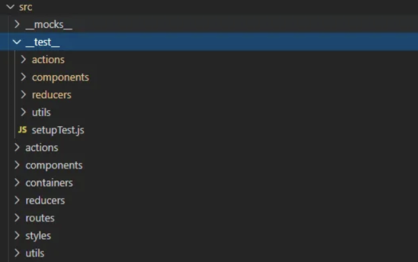

# JEST - Guía básica para empezar

## 01 Instalar
Para configurar tu entorno para trabajar con *Jest*, lo primero que tienes que hacer es instalar la **dependencia de desarrollo**, dependiendo del manejador de paquetes que estés usando, así:

```bash
# Usando npm
npm install --save-dev jest

# Usando yarn
yarn add --dev jest
```

## 02 Scripts
Además, debes añadir en tu `package.json`, la configuración en los scripts para decirle que vas a estar usando Jest para las pruebas:

```json
"scripts": {
  "test": "jest"
}
```

## 03 Ejecutar
Una vez instalado, los comandos básicos para realizar pruebas son:

```bash
# Usando npm
npm run test

# Usando yarn
yarn test
```

Por convención, lo ideal es que generes una carpeta llamada `__tests__`, donde vas a ir creando la estructura de tus pruebas, tal como está organizado tu código. De esta forma, será más fácil entender a qué corresponde cada prueba que realices.



## 04 Función Prueba
Una de las pruebas más comunes es evaluar si el ***output* de una función** es **equivalente a un resultado específico**. Por ejemplo, en una ecuación como `1 + 1`, siempre te debe dar `2`. Imagina que tienes el siguiente archivo `suma.js` donde simplemente tienes una función que recibe dos inputs y devuelve el resultado de la suma.

```javascript
// suma.js
function suma(a, b) {
  return a + b;
}

module.exports = suma;
```

## 05 Test Prueba
Si quieres probar que esto siempre va a ejecutarse correctamente, una opción de prueba sería la siguiente. Creas tu archivo test, que se llamará exactamente como tu archivo original, pero con una extensión `.test`, algo como: `suma.test.js`.

```javascript
// suma.test.js
const suma = require('./suma');

test('suma 1 + 2 es igual a 3', () => {
  expect(suma(1, 2)).toBe(3);
});
```

## 06 Diferencia entre `test` e `it`

En *Jest*, puedes definir una prueba individual usando tanto `test` como `it` . **No hay diferencia funcional entre ellos**, es decir, ambos hacen exactamente lo mismo. La elección de uno u otro depende del estilo de escritura que prefieras:

- **`test`**: Es más descriptivo y directo. Se usa comúnmente cuando quieres enfatizar que estás definiendo una prueba.
    
``` javascript 
test('suma 1 + 2 es igual a 3', () => {
  expect(suma(1, 2)).toBe(3);
});  
```

- **`it`**: Proviene de la filosofía de *Behavior-Driven Development (BDD)* y se usa para describir el comportamiento esperado de una función o componente. Es más común en contextos donde se busca que las pruebas lean como frases descriptivas.

```javascript
it('debería devolver 3 cuando se suman 1 y 2', () => {
  expect(suma(1, 2)).toBe(3);
});
```

### ¿Cuál usar?

- Usa `test` si prefieres un enfoque más técnico y directo.
- Usa `it` si buscas que tus pruebas sean más legibles y se lean como especificaciones de comportamiento.

Ambos son intercambiables, por lo que puedes elegir el que mejor se adapte a tu estilo de código o al estándar de tu equipo.

## 07 Métodos comunes de comparación

- `.toBe()` ⟶ usa `Object.is` para probar la igualdad exacta.
- `.toEqual()` ⟶ comprueba recursivamente cada campo de un objeto o array.
- `.toBeNull()` ⟶ solo coincide con `null`.
- `.toBeUndefined()` ⟶ solo coincide con `undefined`.
- `.toBeDefined()` ⟶ es lo opuesto a `.toBeUndefined()`.
- `.toBeTruthy()` ⟶ coincide con cualquier cosa que una declaración `if` trate como verdadera.
- `.toBeFalsy()` ⟶ coincide con cualquier cosa que una declaración `if` trate como falsa.

## 08 Otros métodos de comparación

### Comparaciones Numéricas
- `.toBeGreaterThan()` ⟶ mayor que.
- `.toBeGreaterThanOrEqual()` ⟶ mayor o igual que.
- `.toBeLessThan()` ⟶ menor que.
- `.toBeLessThanOrEqual()` ⟶ menor o igual que.

### Comparaciones Cadenas de Texto
- `.toMatch()` ⟶ compara el string con una expresión regular.
- `.not.toMatch()` ⟶ compara el string con una expresión regular que NO debe estar en el texto.

### Iterables
- `.toContain()` ⟶ chequea si un array u objeto, contiene un ítem particular.

