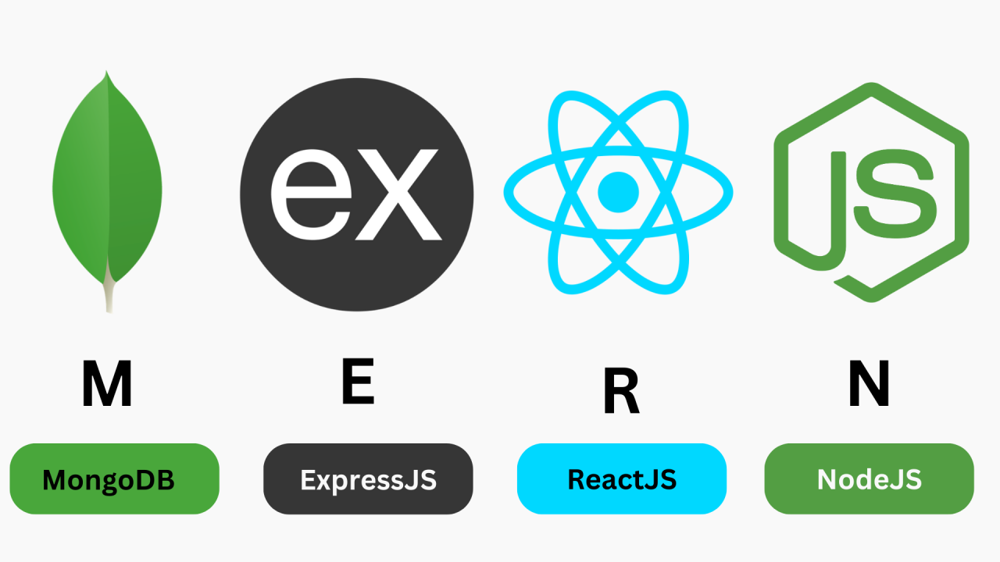

# Desarrollo Web Full Stack Online Oct_24

### JS, ES6, Frontend, Backend, testing, Deploy. Stack MERN: Mongo, Express, React, Node.js 

  

## ¿Qué vas a aprender?
A dominar las tecnologías Front-end y Back-end en desarrollo web.
A crear interfaces de usuario atractivas.
A gestionar eficientemente las bases de datos y los servidores.
A profundizar en las tecnologías y los lenguajes de programación más utilizados en empresas para desarrollo web.
Aprende sobre HTML; CSS, JavaScript, Express, Node JS, React y bases de datos con MongoDB y SQL.
 

###### top
# 🗺️ Navegación rápida

- **HTML | CSS | JS Fundamentals** [Sprints 1 y 2](#ramp-up)
- **JS Avanzado** [Sprints 3 a 8](#js_avanzado)
- **Backend** Sprints 9 a 15
- **Frontend** Sprints 18 a 24

✅ [Challenges Resueltos](https://github.com/BeaSerrano/Challenges)

###### Nota: para abrir los enlaces en una nueva pestaña CTRL+click (en Windows y Linux) o CMD+click (en MacOS) sobre el link.

 

# 📚 Temario

##### Ramp Up
### 🚀 SPRINT 1. HTML y CSS
### [HTML Fundamentos](./01_Ramp_Up/01_html/)
- Lenguaje de marcado y lado del cliente
- Encabezados, párrafos, formato de texto, citas, listas, comentarios
- Enlaces, tablas y etiquetas multimedia
- Formularios y etiquetas semánticas

### [CSS](./01_Ramp_Up/02_css/) 

### 1. Introducción a CSS
- ¿Qué es CSS?
- Un elemento en CSS
- Conectando HTML y CSS
- Selectores, modelo de cajas y posición 
- Display & Flexbox

###  2. Flexbox y Media Queries
- Mobile first y media queries
- Transform, transiciones y animaciones

### 🚀 SPRINT 2. [JS Fundamentos](./01_Ramp_Up/03_js/) 
- Variables y tipos de datos
- Operadores, Arrays y Bucles
- Funciones, Condicionales y Objetos

##### [Volver arriba](#top)

##### Core
### [JS_Avanzado](./02_JavaScript_Avanzado)

### 🚀 SPRINT 3. [JS Avanzado 1](./02_JS_avanzado/sprint_3/)
- Terminal y comandos
- Git y GitHub
- DOM, nodos y eventos
- SetAttribute

### 🚀 SPRINT 4. [JS Avanzado 2](./02_JS_avanzado/sprint_4/)
- Funciones puras y arrays
- Métodos de array
- Fetch

### 🚀 SPRINT 5. [JS Avanzado 3](./02_JS_avanzado/sprint_5/)
- Destructuring 
- Spread Operator y Rest Operator
- Bucles avanzados
    - Foreach, Map, Reduce, Filter
- localSotrage y sessionStorage
- Métodos de objeto

### 🚀 SPRINT 6. [JS Avanzado 4](./02_JS_avanzado/sprint_6/)
- Asincronía y promesas 
- Async/Await
- Axios
- API

### 🚀🧑🏻‍🚀 SPRINTS 7 y 8. [Project Break 1](./05_project_break/)

##### [Volver arriba](#top)

### [BACKEND](./03_Backend/)

### 🚀 SPRINT 9. [node.js](./03_Backend/sprint_9/)
- Que es Node.js
- Asincronía y Eventos
- Modulos
- Modulo HTTP
- Modulo File System
- Modulo URL
- NPM
- Event Loop
- Creación de Servidores HTTP
- Rutas y Métodos HTTP

### 🚀 SPRINT 10. [express.js](./03_Backend/sprint_10/)
- Que es Express.js
- Rutas
- Middlewares
- Plantillas de vistas
- Enrutamiento modular
- Manejo de Archivos Estáticos
- Instalación y configuración